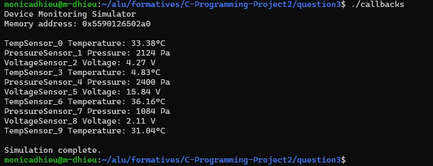

# Callback-Based Device Monitoring Simulator

## Overview

This is a simulation program that models a simple device monitoring system. It uses structures, unions, dynamic memory allocation, arrays of structures, and function pointers (callbacks).

The program simulates devices that generate random readings and processes them using different callback functions.

---

## Features

The program simulates ten devices and processes them using callbacks.

Each device belongs to one of these categories:

1. **Temperature Sensors**
   - Measures temperature in degrees Celsius

2. **Pressure Sensors**
   - Measures pressure in Pascals

3. **Voltage Sensors**
   - Measures electrical voltage

---

## Functionality

The program performs the following:

- Dynamically allocates memory for 10 devices
- Generates random readings for each device
- Uses a **union** to store different types of sensor data
- Uses **function pointers (callbacks)** to process each device type
- Prints device readings using appropriate monitoring functions
- Displays memory address of allocated device array
- Frees all allocated memory after execution

---

## Sample Output

